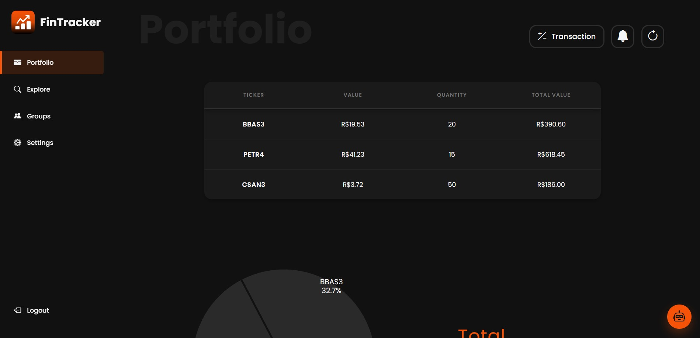
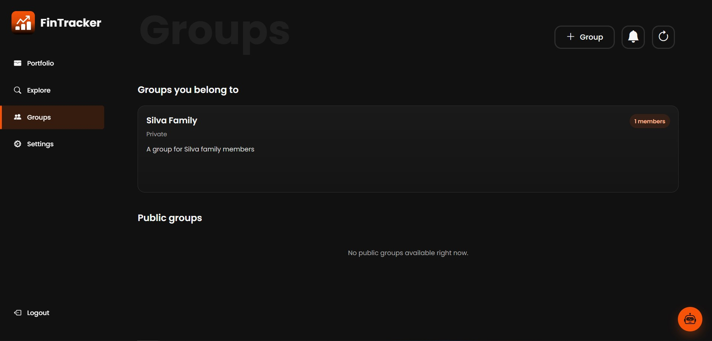
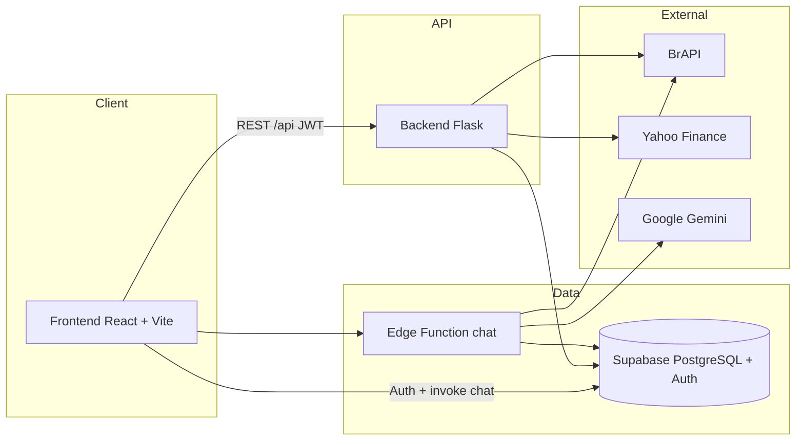

# FinTracker

A web tool to track and simulate B3 stock portfolios, not a brokerage.

[](./frontend)
[](./backend)
[](./supabase)
[](./LICENSE)
[](#roadmap--next-steps)

<!-- INSERT HERE: screenshot of the Portfolio (Carteira) screen with sample data — positions table, pie chart, and transaction history -->


## About the project

**FinTracker** was built to replace spreadsheets and handwritten notes for investment tracking. Instead of ad-hoc Excel formulas, users record buys and sells in a purpose-built environment: consolidated portfolio, watchlist, price and dividend charts, collaborative groups, and an AI assistant for day-to-day questions.

The target audience is the **individual investor**, especially anyone who follows **B3** stocks and wants organization, clarity, and collaboration (family, investment club, mentor/student) without the complexity of a professional trading terminal.

**Important:** FinTracker is **not a brokerage** and **does not place market orders**. It also **does not auto-sync** with broker accounts. Transactions are entered manually (a structured tracking/simulation scratch pad). Quotes come from external APIs (BrAPI / Yahoo Finance) and are cached in the database, by design, not by omission.

## Features

### Authentication and security

- Sign up and sign in with email and password (Supabase Auth)
- Password recovery and reset via email
- Optional MFA (TOTP) with QR Code (Google Authenticator, Authy, etc.)
- Protected internal routes; API requests authenticated with JWT (`authFetch`)
- Row Level Security (RLS) for groups and notifications

### Portfolio and transactions

- Consolidated positions view (ticker, price, quantity, total value)
- Portfolio allocation pie chart (Recharts)
- Buy/sell history with edit and delete
- Transaction logging (buy/sell) with price, quantity, and date
- Batch quote refresh via reload button
- Frontend local cache (~5 minutes) with manual refresh

### Explore and watchlist

- Search stocks by ticker or company name
- Watchlist with current quote and latest dividend
- Quick add/remove from the UI
- Stock detail page (`/:ticker`) with price charts (7d / 1m / 3m) and dividends

### Groups and collaboration

- Create groups with name, description, visibility, and optional member limit
- Visibility: public, restricted (approval), or private (invite-only)
- Roles: founder, leader, and member
- Direct invites and invite links; approve/reject join requests
- Granular permissions to **view** and **manage** other members’ portfolios
- Re-consent when permissions become more permissive
- Member portfolio modal (`MemberWalletModal`)

<!-- INSERT HERE: screenshot of the Groups screen (group list + details/members modal) OR the chatbot open answering a question -->


### Notifications

- Alert center on authenticated pages
- Group invites, requests, approvals/rejections
- Permission re-consent prompts
- Actions by other members on the user’s portfolio
- MFA-related alerts
- Mark as read (single or all)

### AI assistant

- Chat widget on **Portfolio**, **Explore**, and **Groups**
- Supabase Edge Function (`chat`) powered by **Google Gemini**
- Answers grounded in the product knowledge base, user data, and quotes/dividends (BrAPI)
- Portuguese (pt-BR) and English support; light Markdown responses
- Does not recommend buying or selling specific assets

### Personalization and i18n

- Light / dark theme
- Font size (small, medium, large)
- Languages: **Portuguese (pt-BR)** and **English (en)**
- Landing page with login/sign-up access and quick preferences

### Market data

- **Prices:** BrAPI, cached in PostgreSQL (`stock_prices`)
- **Dividends:** Yahoo Finance (`yfinance`), cached (`stock_dividends`)
- Backend decides when to fetch externally vs. serve from cache (including `force_update`)

## Architecture

Flask acts as a **middleware** between the frontend and data sources: it keeps API tokens (BrAPI) off the browser, applies business rules (portfolio, groups, transactions), and maintains a **cache** of prices/dividends in Supabase to reduce external calls and normalize responses.



### Repository structure

```
FinTracker/
├── frontend/     # React + Vite (UI, routes, charts, i18n)
├── backend/      # Flask API (prices, portfolio, groups, transactions)
├── supabase/     # SQL migrations + chat Edge Function
├── chatbot/      # AI assistant knowledge base
├── DOCUMENTACAO.md
└── README.md
```

### Main API routes (Flask)

| Area | Endpoints (examples) |
|------|----------------------|
| Health | `GET /api/health` |
| Auth | `POST /api/auth/register`, `/login`, `/user/update`, `/user/update-password`, `/reset-password/recovery` |
| MFA | `GET /api/mfa/status` |
| Portfolio / watchlist | `GET /api/portfolio/full`, `POST /api/portfolio/update-prices-login`, and `/api/watchlist/...` equivalents |
| Transactions | `GET/POST /api/transactions`, `PATCH/DELETE /api/transactions/:id` |
| Stocks | `POST /api/stocks/:ticker/view`, `/refresh`; `GET /api/prices/:ticker`, `/api/dividends/:ticker` |
| Groups | CRUD + members, invites, join/leave, wallet, and reconsent (`/api/groups/...`) |
| Notifications | `GET /api/notifications`, `PATCH .../read`, `PATCH .../read-all` |

### Data model (summary)

Tables used by the code (in addition to group/notification migrations in `supabase/migrations/`):

| Table | Role |
|-------|------|
| `users` | Profile linked to Auth |
| `stocks` | Asset catalog (ticker) |
| `stock_prices` / `stock_dividends` | Market data cache |
| `user_portfolio` / `user_watchlist` | Positions and watchlist |
| `transactions` | Buys and sells |
| `groups`, `group_members`, `group_join_requests`, `group_invites` | Collaboration |
| `notifications` | System alerts |

## Tech stack

| Layer | Technologies |
|-------|-------------|
| **Frontend** | React 19, Vite 7, React Router DOM 7, Recharts 3, Bootstrap Icons, custom CSS (themes), i18next / react-i18next, react-markdown |
| **Backend** | Python, Flask 3, Flask-CORS, python-dotenv, requests, bcrypt, python-dateutil |
| **Database** | Supabase (PostgreSQL 17), SQL migrations, RLS |
| **Authentication** | Supabase Auth (email/password, recovery, MFA TOTP) + `@supabase/supabase-js` / Python SDK |
| **AI** | Supabase Edge Function (`supabase/functions/chat`) + Google Gemini; knowledge base in `chatbot/knowledge_base.md` |
| **Market data** | BrAPI (quotes), Yahoo Finance / `yfinance` (dividends) |
| **Deploy** | No deploy config is versioned in this repository (no Vercel/Render/Dockerfile at the root). Run locally as described below. |

## Running locally

### Prerequisites

- Node.js (20+ recommended)
- Python 3.10+
- A Supabase project with Auth enabled and domain tables created
- [BrAPI](https://brapi.dev) account/token for quotes
- (Optional, for chat) `GEMINI_API_KEY` and `BRAPI_TOKEN` as secrets on the `chat` Edge Function

> See also `backend/docs/SUPABASE_SETUP.md` and migrations under `supabase/migrations/`.

### 1. Backend

```bash
cd backend
python -m venv venv

# Windows
venv\Scripts\activate

# Linux / macOS
# source venv/bin/activate

pip install -r requirements.txt
copy .env.example .env   # or: cp .env.example .env
```

Edit `backend/.env` (variable **names** only — do not commit real secrets):

```env
FLASK_ENV=development
PORT=5000
SECRET_KEY=
DATABASE_URL=
API_KEY=
CORS_ORIGINS=http://localhost:5173,http://localhost:3000
SUPABASE_URL=
SUPABASE_ANON_KEY=
BRAPI_TOKEN=
```

```bash
python app.py
```

API at `http://localhost:5000` — smoke test: `GET /api/health`.

### 2. Frontend

```bash
cd frontend
npm install
copy .env.example .env   # or: cp .env.example .env
```

Edit `frontend/.env`:

```env
VITE_BACKEND_PROTOCOL=http
VITE_BACKEND_HOST=localhost
VITE_BACKEND_PORT=5000
VITE_SUPABASE_URL=
VITE_SUPABASE_ANON_KEY=
```

> The frontend `.env.example` suggests port `5001`; Flask defaults to `5000`. Keep `VITE_BACKEND_PORT` aligned with the backend `PORT`.

```bash
npm run dev
```

UI at `http://localhost:5173` (Vite default).

### 3. Chat (Edge Function)

For the assistant end-to-end, deploy `supabase/functions/chat` to your Supabase project and set the secrets (`GEMINI_API_KEY`, `BRAPI_TOKEN`, etc.). The frontend calls `supabase.functions.invoke('chat', ...)`.

## Roadmap / next steps

Based on the current codebase:

- [ ] **Landing page** — initial version exists (`Landing.jsx`); expand content and presentation
- [ ] **Fully versioned schema** — repo migrations cover groups/notifications; formalize DDL for core tables (`users`, `stocks`, `transactions`, etc.)
- [ ] **Scaffolding cleanup** — example routes/models (`supabase_example_routes`, `example_service`, `example_model`) still in the backend
- [ ] **Documented deploy** — no hosting/pipeline is versioned; define staging/production
- [ ] **Future integrations (not implemented)** — broker sync, live orders, or multi-broker support are *out of scope* today

## Flow demo

<!-- INSERT HERE: short GIF of the "Add transaction" flow — open Portfolio → Transaction → fill a buy → save → position appears in the table -->


## License and author

This project is licensed under the **[MIT](./LICENSE)** License.

**Author:** Matheus Shiokawa Silva  
**Repository:** [github.com/MatheuShio7/FinTracker](https://github.com/MatheuShio7/FinTracker)

Additional system documentation: [`DOCUMENTACAO.md`](./DOCUMENTACAO.md).
